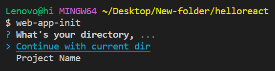
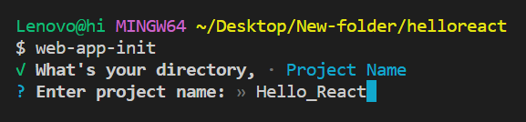
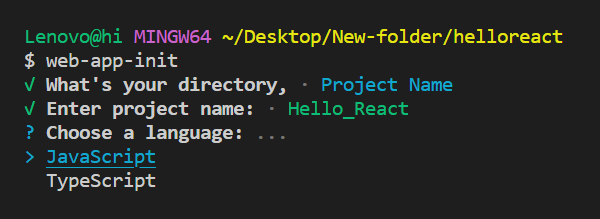
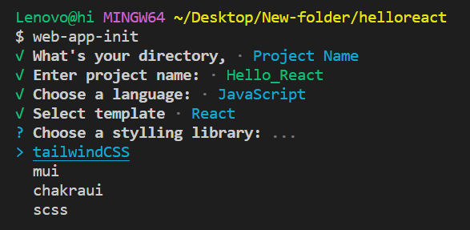

# Web App Init

**Command Line Interface (CLI) for Bootstrapping React Templates**

Web App Init is a powerful and user-friendly CLI tool that allows you to quickly bootstrap new React applications with different templates, configurations, and styling options. It simplifies the process of setting up a new project by providing a streamlined interface for selecting your preferred stack.

## Features

- 🚀 **Effortless Installation**: Get started with your project in seconds. Simply run `npx web-app-init` to initiate the installation process.
- 🛠 **Template Customization**: Choose from a variety of React templates, including TypeScript and JavaScript, and customize your project based on your specific needs.

- 🎨 **Styling Options**: Tailwind CSS, MUI, Chakra UI, CSS, or SCSS – select the styling library that best suits your project requirements.

- ⚙️ **Webpack Configuration**: Open up the webpack configuration to tailor your project for production. Customize to your heart's content for advanced optimization and performance tweaks.

- 💻 **Beautiful Terminal Prompts**: Enjoy an interactive and visually appealing input experience using the `enquirer` library.

## Usage

1. **Run the Installer**:

   - Install `web-app-init` as a global dependency.
     ```bash
     npm i -g web-app-init
     ```
   - Run the following command:
     ```bash
     web-app-init
     ```
   - Alternatively, you can use `npx` directly:
     ```bash
     npx web-app-init
     ```

2. **Follow the Prompts:**

   - Select your directory to use.

   
   

   - Select your preferred template (TypeScript or JavaScript).

   

   - Choose your styling library (Tailwind CSS, MUI, Chakra UI, CSS, or SCSS).

   

3. **Hooray, Ready to Use!**

   ```bash
   cd folder-name
   npm i
   npm start
   ```

## Contributors

A big thank you to the contributors who have made this project possible:

- [Deepak Mandal](https://github.com/deepumandal)

## License

This project is licensed under the **MIT** License.
